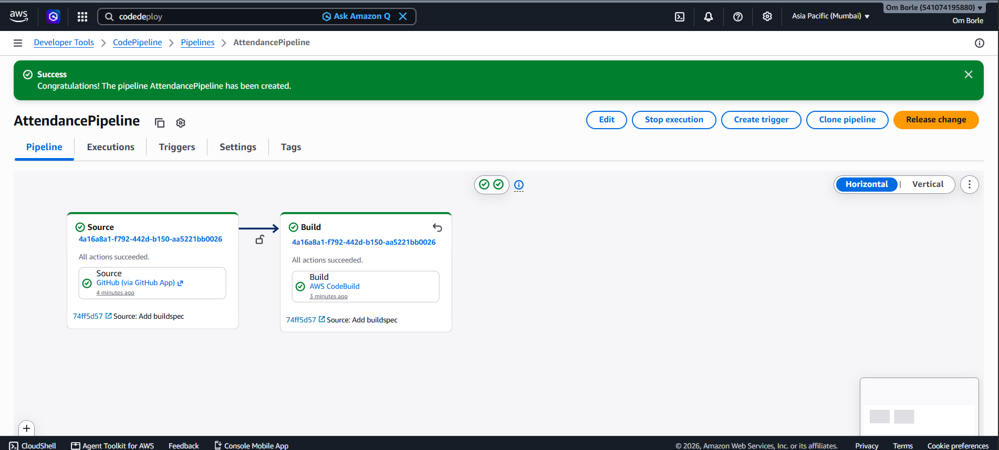
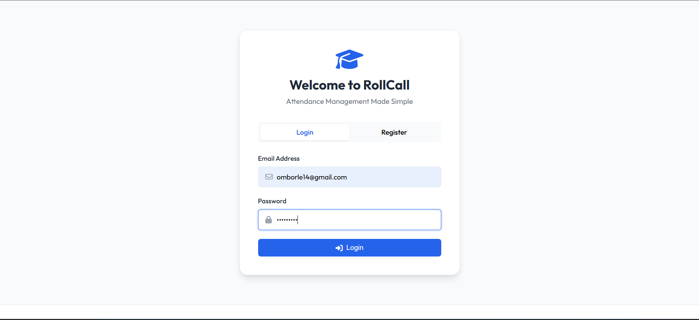
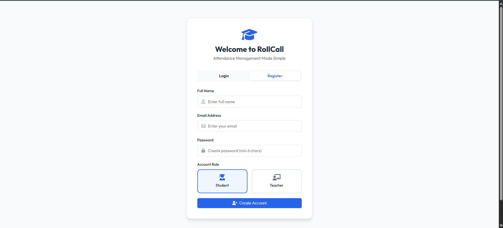
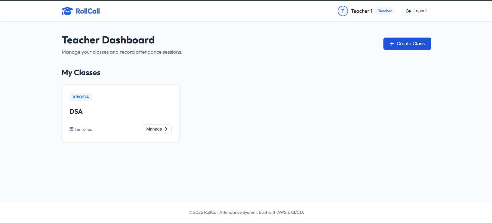

# Attendance Management System (AWS CI/CD Demo)

A simple, modern, and production-ready Attendance Management System. This project is built using vanilla technologies (no complex heavy frameworks) to make it easy to learn, run, and demonstrate complete CI/CD automation pipelines using GitHub, AWS CodePipeline, AWS CodeDeploy, and Nginx on Amazon EC2.

---

## 🛠️ Technology Stack

*   **Frontend**: Single Page Application (SPA) with semantic HTML5, Vanilla CSS, and modern Vanilla JavaScript (`public/index.html`, `public/style.css`, `public/app.js`).
*   **Backend**: Node.js + Express API (`server.js`).
*   **Database**: AWS DynamoDB (3 tables: `Users`, `Classes`, `Attendance`).
*   **Authentication**: JSON Web Tokens (JWT) + passwords secured using `bcryptjs`.
*   **Deployment Target**: AWS EC2 running Ubuntu Server, Nginx (reverse proxy), and PM2 (process manager).
*   **CI/CD Pipeline**: GitHub → AWS CodePipeline → AWS CodeDeploy → EC2.

---

## 📂 Folder Structure

```text
attendance-system/
├── public/                 # Static frontend files (SPA)
│   ├── index.html          # Main application page layout
│   ├── style.css           # Custom theme and styles
│   └── app.js              # Application logic and API handlers
├── routes/                 # Express API routing logic
│   ├── auth.js             # User login and registration
│   ├── teacher.js          # Classes, student list, and marking attendance
│   └── student.js          # Class enrollment and personal logs
├── middleware/
│   └── auth.js             # JWT authentication gatekeeper
├── scripts/                # CodeDeploy lifecycle script hooks
│   ├── before_install.sh   # Installs server runtime, PM2, and Nginx
│   ├── after_install.sh    # Installs NPM package modules
│   ├── start_server.sh     # Boots or reloads server using PM2
│   └── stop_server.sh      # Halts the running PM2 server instances
├── db.js                   # DynamoDB client initialization
├── server.js               # Node Express server launcher
├── appspec.yml             # CodeDeploy instructions configuration
├── package.json            # Node module definition manifests
└── .env.example            # Environment configuration template
```

---

## ⚙️ Prerequisites & Setup

### 1. DynamoDB Tables Setup
Create the following **3 DynamoDB Tables** in your AWS Console (ensure the region matches the one in your environment configuration):

1.  **`Users`**:
    *   **Partition Key**: `userId` (String)
2.  **`Classes`**:
    *   **Partition Key**: `classId` (String)
3.  **`Attendance`**:
    *   **Partition Key**: `attendanceId` (String)

*(Note: The server uses simple Scan operations for authentication and joins to minimize complex GSI configuration steps. For higher scales, consider adding Global Secondary Indexes on `email` and `classCode`).*

#### DynamoDB Tables Preview:
| Users Table | Attendance Table |
|---|---|
|  |  |

### 2. Local Setup and Running
To run the project locally on your machine:

1.  Clone the repository and install packages:
    ```bash
    npm install
    ```
2.  Create a `.env` file based on `.env.example`:
    ```env
    PORT=3000
    JWT_SECRET=super-secret-attendance-key-9999
    AWS_REGION=us-east-1
    # Add your credentials if not running on AWS with IAM role permissions:
    # AWS_ACCESS_KEY_ID=your_access_key
    # AWS_SECRET_ACCESS_KEY=your_secret_key
    ```
3.  Start the application:
    ```bash
    npm start
    ```
4.  Open `http://localhost:3000` in your web browser.

---

## 🚀 AWS CI/CD Pipeline Configuration

This application is fully automated to deploy updates on every git commit.



### Step 1: Prepare the EC2 Instance
1.  Launch an **Ubuntu Server** on EC2.
2.  Configure your Security Group to allow inbound traffic on **Port 80 (HTTP)**, **Port 443 (HTTPS)**, and **Port 22 (SSH)**.
3.  Attach an IAM Instance Profile (Role) to the EC2 instance with the following permissions:
    *   `AmazonDynamoDBFullAccess` (or restricted table permissions)
    *   `AmazonSSMManagedInstanceCore` (for SSM/CodeDeploy agent)
4.  Install the **CodeDeploy Agent** on the instance.

### Step 2: Nginx Reverse Proxy Setup
SSH into your EC2 instance and configure Nginx to route external requests on port 80 to the Node.js server running on port 3000:
1.  Edit `/etc/nginx/sites-available/default`:
    ```nginx
    server {
        listen 80 default_server;
        listen [::]:80 default_server;

        root /var/www/html;
        index index.html index.htm;

        server_name _;

        location / {
            proxy_pass http://localhost:3000;
            proxy_http_version 1.1;
            proxy_set_header Upgrade $http_upgrade;
            proxy_set_header Connection 'upgrade';
            proxy_set_header Host $host;
            proxy_cache_bypass $http_upgrade;
        }
    }
    ```
2.  Restart Nginx:
    ```bash
    sudo systemctl restart nginx
    ```

### Step 3: Configure AWS CodeDeploy
1.  Go to the AWS Console → **Developer Tools** → **CodeDeploy**.
2.  Create an Application with compute platform **EC2/On-Premises**.
3.  Create a Deployment Group:
    *   Deployment type: **In-place**.
    *   Environment configuration: Select **Amazon EC2 instances** and specify your instance tag keys.
    *   Agent configuration: **Now and schedule updates**.
    *   Service Role: Set an IAM Service Role giving CodeDeploy permissions to interact with EC2.

### Step 4: Setup AWS CodePipeline
1.  Go to **CodePipeline** in AWS and click **Create Pipeline**.
2.  **Source Stage**: Choose **GitHub (Version 2)**, connect your account, and select this repository and the `main` branch.
3.  **Build Stage**: Skip this stage (we do not need to build static compilation files for our vanilla Node.js architecture).
4.  **Deploy Stage**: Choose **AWS CodeDeploy**, select the application name, and select the deployment group created in Step 3.
5.  Complete the setup and release your pipeline! Now, any push to the `main` branch will automatically deploy your code onto your EC2 server in real-time.

---

## 📸 Project Screenshots

### Authentication & Landing Page
| Login | Registration |
|---|---|
|  |  |

### User Dashboards
| Teacher Dashboard | Student Dashboard |
|---|---|
|  |  |

### Class Operations
| Create Class Modal |
|---|
|  |
